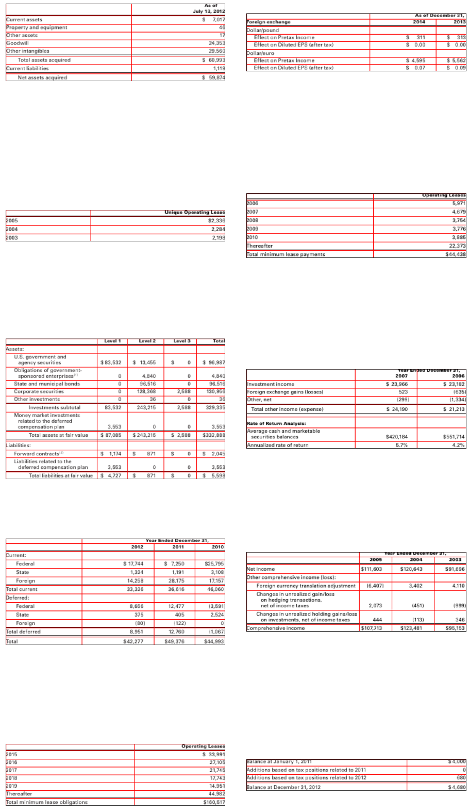

# SPLERGE_via_TF
Implementation of SPLERGE model for table structure recognition via TensorFlow. For reference please check original paper: 

C. Tensmeyer, V. I. Morariu, B. Price, S. Cohen and T. Martinez, "Deep Splitting and Merging for Table Structure Decomposition," 2019 International Conference on Document Analysis and Recognition (ICDAR), 2019, pp. 114-121, doi: 10.1109/ICDAR.2019.00027.

# Usage
To train SPLIT model use script `train_split_model.py`. 
To train MERGE model use script `train_merge_model.py`.
Run with `--help` argument to view usage info.

# Results

We have trained SPLIT model on GPU (NVIDIA GeForce GTX 1080 Ti) for 100 epochs and obtained following results on validation set:

|                   | Intervalwise F-score |
| ----------------- | -------------------- |
| Horz split points | 0.9668               |
| Vert split points | 0.9600               |

We have trained MERGE model for 100 epochs and obtained val_loss = 0.1372.

# Images

Fig 1. MERGE model predictions on validation dataset.

# Conclusion

As we see, SPLIT architecture generalizes pretty well, even when trained on such a sparse dataset.
MERGE architecture failed to generalize well, because there is not enough spanning cells in training dataset.
As we know from the original paper, simple heuristic postprocessing works much better.